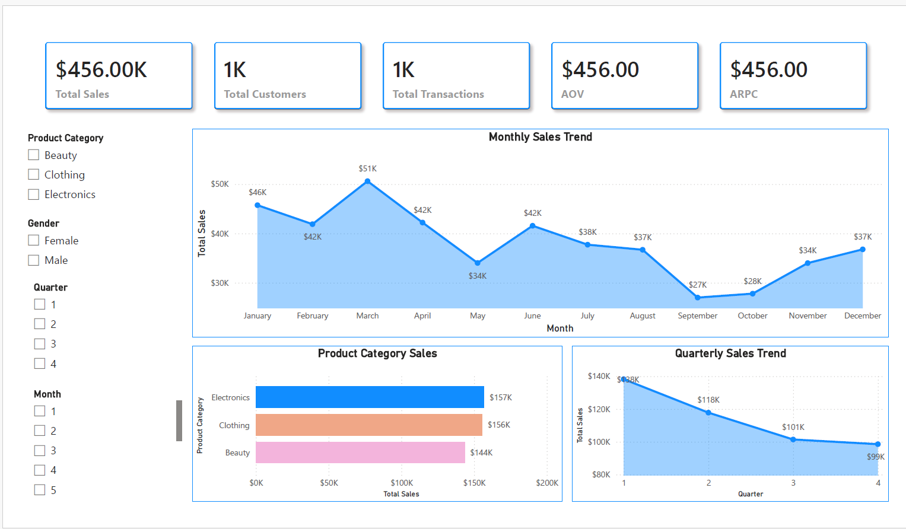

# Retail Sales Analysis

---

## 📊 Power BI Dashboard

The Power BI dashboard provides:

- Executive KPI cards
- Monthly Sales Trend
- Sales by Product Category
- Quarterly Sales Trend
- Interactive filters for Product Category, Gender, Quarter, and Month

The dashboard is designed to provide management with a quick overview of sales performance and allow further exploration of the data.c

---

## 📊 Project Overview

An end-to-end retail sales analysis project designed to understand sales performance, customer behavior, product category performance, and sales trends over time.

The project uses Python, MySQL, Power BI, and Excel to transform raw retail transaction data into business insights and an interactive dashboard.

---

## 🎯 Business Problem

The business wants to understand its sales performance and identify important patterns across customers, product categories, months, and quarters.

The analysis focuses on:

- Identifying top-performing product categories
- Understanding customer purchasing behavior
- Identifying high-value customers
- Analyzing monthly and quarterly sales performance
- Investigating changes in product category performance

---

## 🎯 Business Objectives

1. Identify the top-performing product category
2. Analyze customer demographics and purchasing behavior
3. Identify high-value customers
4. Analyze quarterly sales performance
5. Identify product performance trends across quarters

---

## 👥 Stakeholders

- CEO
- Sales Manager
- Reporting/Data Manager

---

## 🛠️ Tools & Technologies

| Tool | Purpose |
|---|---|
| Python | Data cleaning and exploratory analysis |
| Pandas | Data manipulation and analysis |
| NumPy | Numerical operations |
| Matplotlib | Data visualization |
| MySQL | Data storage and SQL analysis |
| Power BI | Interactive dashboard and reporting |
| Excel | Supporting analysis |

---

## 🔄 Project Workflow

Raw Dataset  
↓  
Python Data Understanding & Cleaning  
↓  
Exploratory Data Analysis  
↓  
MySQL Database  
↓  
SQL Business Analysis  
↓  
Power BI Dashboard  
↓  
Business Insights & Recommendations

---

## 📌 Key KPIs

- Total Sales
- Total Customers
- Total Transactions
- Total Quantity Sold
- Average Order Value (AOV)
- Average Revenue per Customer (ARPC)

---

## 📊 Key Findings

### Overall Performance

- Total Sales: **$456,000**
- Total Customers: **1,000**
- Total Transactions: **1,000**
- Total Quantity Sold: **2,514**
- AOV: **$456**
- ARPC: **$456**

### Product Category Performance

**Electronics** was the highest revenue-generating product category with approximately **$157K** in sales.

Clothing followed closely at approximately **$156K**, while Beauty generated approximately **$144K**.

### Monthly Performance

Monthly sales fluctuated throughout the year.

- **March** recorded the highest monthly sales at approximately **$51K**.
- **September** recorded the lowest monthly sales at approximately **$27K**.

### Quarterly Performance

Quarterly sales showed a progressive decline throughout the year:

**Q1 → Q2 → Q3 → Q4**

- Q1: **$138K**
- Q2: **$118K**
- Q3: **$101K**
- Q4: **$99K**

Q1 recorded the highest quarterly sales, while Q4 recorded the lowest.

### Customer Analysis

The highest-spending customer contributed only **0.44%** of total revenue, indicating that revenue is distributed across a broad customer base rather than being highly concentrated in one customer.

### Q3 Category Analysis

All product categories experienced a decline during Q3.

Clothing showed a particularly significant decline compared with the previous quarters.

---

## 💡 Business Recommendations

- Investigate the reasons behind the progressive quarterly sales decline.
- Review promotional activity during weaker sales periods.
- Analyze inventory availability to determine whether stock constraints affected sales.
- Investigate the significant Q3 decline in the Clothing category.
- Monitor Electronics inventory and performance because it is the highest revenue-generating category.
- Compare future sales performance against the monthly and quarterly benchmarks identified in this analysis.

---

## ⚠️ Data Limitations

The dataset has several limitations:

- Each customer has one transaction in the dataset, limiting repeat-purchase and customer-retention analysis.
- Historical data for multiple years is unavailable for year-over-year comparisons.
- Promotion and discount information is unavailable.
- Inventory information is unavailable.
- External factors affecting customer demand are unavailable.

Therefore, potential causes of sales declines should be treated as hypotheses requiring further investigation rather than confirmed causes.

---

## 📂 Project Files

- `Retail_Sales_Analysis.ipynb` — Python analysis and data exploration
- `retail_analysis_queries.sql` — MySQL business analysis queries
- `Retail_Sales_Dashboard.pbix` — Power BI dashboard
- `Retail_Sales_Dashboard.pdf` — Dashboard export

---

## 🧠 Skills Demonstrated

- Data Understanding
- Data Cleaning
- Exploratory Data Analysis
- Business Requirement Analysis
- KPI Development
- Python
- Pandas
- NumPy
- SQL
- MySQL
- Window Functions
- Power BI
- DAX
- Dashboard Design
- Business Storytelling
- Data-driven Recommendations
